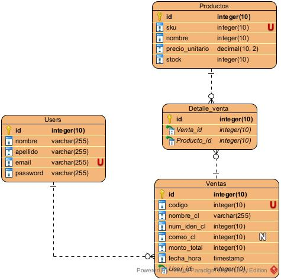

# IDBI Challenge

## Descripción
API de ventas que permite la gestión de productos, vendedores y ventas. 

## Requisitos
- **Laravel 12** (versión más actual)
- **Composer** (para gestionar dependencias)
- **MySQL** (base de datos)
- **Postman** (para probar las rutas de la API)

## Instalación

1. **Clonar el repositorio**
   ```bash
   git clone https://github.com/JoanAquinoVasquez/SistemaVentas-IDBi.git
   cd SistemaVentas-IDBi
   ```

2. **Instalar dependencias**
   ```bash
    composer install
   ```

3. **Configurar variables de entorno**
   ```bash
   cp .env.example .env
   ```

   Modifica las credenciales de la bd según tu entorno local.

   ```bash
    DB_CONNECTION=mysql
    DB_HOST=127.0.0.1
    DB_PORT=3306
    DB_DATABASE=db_ventas_idbi
    DB_USERNAME=root
    DB_PASSWORD=
   ```
4. **Crear bd y llenarla**
   ```bash
    php artisan migrate --seed

   ```
5. **Iniciar server**
   ```bash
    php artisan serve

   ```

## Diagrama ERD

- users: usuarios (admin y vendedores)
- sales: ventas
- products: productos
- sales_products: productos por venta

## Postman
Importar la colección de Postman:
1. Abre **Postman**.
2. Ve a **Import** y selecciona el archivo  `SistemaVentas-IDBi.postman_collection.json` ubicado en la raíz del proyecto.
3. Configura las variables url y token.
3.1. Crea un nuevo environment
3.2. Crea las variables token y url. En url coloca la url del servidor por ejm. http://localhost:8000
3.4. Guarda el environment y selecciónalo en la colección.
4. Inicia las pruebas 🚀

## Video explicativo
[Video aquí]()